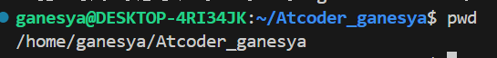
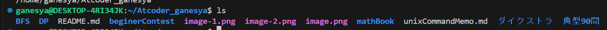
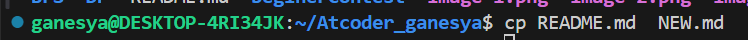

# Commandまとめ
## atcoderする時に使うコマンド
pythonコマンド  
色々あるが一番使うのはやっぱり実行コマンドやね
```unix
python 実行したいファイル名
```

## progateでまなんだunixCommandまとめ
touchコマンド
```

touch [作成したいフォルダー名]

```
 catコマンド
 ```

 cat [見たいファイル名]

 ```
 実行結果例
 

 mkdirコマンド  
 フォルダーを作成するコマンド
 ```

 mkdir [作成したいフォルダー名]

 ```
 cdコマンドについて  
 カレントディレクトリ(子ディレクトリ)⇔ルートディレクトリ
 ```
 cd 移動したいpath
 ```
 pwdコマンド  
 print working directoryの略  
 ```
 pwd
 ```

lsコマンド  
listの略称
```
ls

```
補足  
一つの階層のフォルダーとファイル名しか表示されないので注意！

mv コマンド
```
mv 変化の対象　変更
```
ファイル名やディレクトリの変更やフォルダーやファイルの移動をするコマンド

cpコマンド  
copyの略称
```
cp -r 対象のディレクトリ名　新しいディレクトリ名
```

```
cp 対象のファイル名　新しいファイル名
```



rmコマンド  
ファイルやディレクトリを削除するコマンド  


## 実務でよく使うコマンドまとめ


